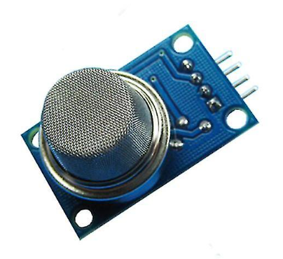
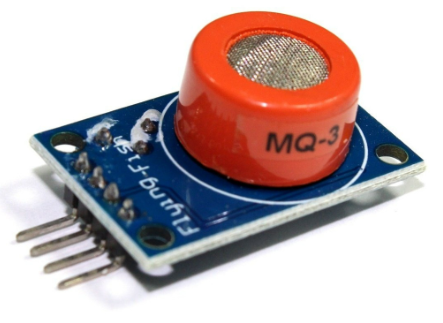
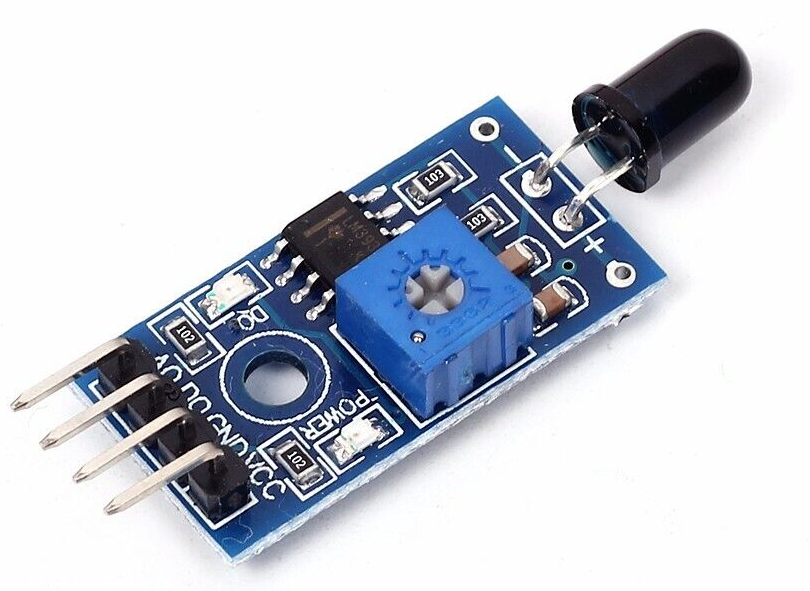

# NMEA2000 Smoke sensor

## Table of contents
- [NMEA2000 Smoke sensor](#nmea2000-smoke-sensor)
  - [Table of contents](#table-of-contents)
  - [Description](#description)
  - [Disclamier](#disclamier)
  - [NMEA 2000](#nmea-2000)
  - [Librarys](#librarys)
  - [Gas / Smoke sensor](#gas--smoke-sensor)
    - [MQ-2 Gas Sensor Module:](#mq-2-gas-sensor-module)
    - [MQ-3 Gas Sensor Module:](#mq-3-gas-sensor-module)
    - [MQ-7 Carbon Monoxide (CO) Gas Sensor Module:](#mq-7-carbon-monoxide-co-gas-sensor-module)
    - [MQ-9 Carbon Monoxide (CO) and Flammable Gas Sensor Module:](#mq-9-carbon-monoxide-co-and-flammable-gas-sensor-module)
  - [Flame sensor](#flame-sensor)
  - [Settings](#settings)
    - [NMEA 2000 Settings](#nmea-2000-settings)
      - [Instance](#instance)
      - [SID](#sid)
    - [Sensor](#sensor)
      - [Sensor Type](#sensor-type)
      - [Threshold](#threshold)
      - [Methode](#methode)
      - [Location](#location)
      - [Alert Message](#alert-message)
  - [WiFi](#wifi)
    - [Default Password](#default-password)
      - [Default IP address](#default-ip-address)
    - [OTA](#ota)
    - [Configuration options](#configuration-options)
  - [Blinking codes](#blinking-codes)
  - [Reset](#reset)


## Description
This smoke and flame sensor is capable of detecting and measuring smoke and fire. Fire is detected on infrared elvel emited from the flames. Depending on the gas sensor used, different gases can be detected for more information see [Gas / Smoke sensor](#gas--smoke-sensor)

## Disclamier
 | | |
 |-|-----------------|
 |  | This device does not replace a professional device in any way. In particular, I decline any guarantee or liability should an accident or damage occur!
Every effort should be made to prevent a fire from starting. |
 |  | The sensors require a lot of energy for heating. The Vin pin may not provide enough voltage to operate the sensor. |


This device does not replace a professional device in any way. In particular, I decline any guarantee or liability should an accident or damage occur!
Every effort should be made to prevent a fire from starting.


## NMEA 2000
The device sends the following PGN's
- 126983, // Alert
- 126984, // Alert response
- 126985, // Alert text 
- 

## Librarys
The Software has been created using Visual Studio with the addon Visual Micro. In order to build it you als need some libraries.
- NMEA2000
- NMEA200_ESP
- [AsyncTCP](https://github.com/dvarrel/AsyncTCP)
- [ESPAsyncWebServer](https://github.com/me-no-dev/ESPAsyncWebServer)
- [IotWebConf](https://github.com/minou65/IotWebConf)
- [IotWebConfAsync](https://github.com/minou65/IotWebConfAsync)
- [IotWebRoot](https://github.com/minou65/IotWebRoot)

## Gas / Smoke sensor
Gas sensors play a vital role in various industries and applications, ensuring safety and enabling efficient monitoring of gas concentrations. Among the popular gas sensor modules available in the market, the MQ Gas Sensor Module Series stands out as a reliable and versatile option.

### MQ-2 Gas Sensor Module:
The MQ-2 gas sensor module is primarily designed for detecting and measuring LPG, propane, butane, methane, alcohol, hydrogen, and smoke concentrations in the air.



### MQ-3 Gas Sensor Module:
The MQ-3 module is suitable for detecting Alcohol, Benzine, CH4, Hexane, LPG, CO



### MQ-7 Carbon Monoxide (CO) Gas Sensor Module:
The MQ-7 gas sensor module is specifically designed for detecting and monitoring carbon monoxide (CO) gas concentrations. 

### MQ-9 Carbon Monoxide (CO) and Flammable Gas Sensor Module:
The MQ-9 gas sensor module combines the ability to detect carbon monoxide (CO) and flammable gases, such as liquefied petroleum gas (LPG), propane, butane, and methane.

## Flame sensor
4 Pin Flame Sensor Module 3.3V-5V Infrared Receiving Module for Arduino DIY Kit



## Settings

### NMEA 2000 Settings

#### Instance
This should be unique at least on one device. May be best to have it unique over all devices sending this PGN. Depending on the number of sensors connected, between 1 and 4 instances are used, starting with the number set here.

#### SID
Sequence identifier. In most cases you can use just 255 for SID. The sequence identifier field is used to tie different PGNs data together to same sampling or calculation time.

### Sensor
#### Sensor Type
What type of sensor is used
- Gas / Smoke
- Flame

#### Threshold
Value used to compare with the measured value

#### Methode
Method with which the measured value is compared with the threshold value

| Methode | Description |
| --- | --- |
| equal | The measured and threshold values must be the same |
| lower than | The measured value must be lower than the threshold value |
| greater than | The measured value must be greater than the threshold value |

#### Location
Location where the sensor is mounted
```
Engine room 
```

#### Alert Message
Enter an alarm message here. This is sent via the NEMA network in the event of an alert
```
Smoke detected in the engine room
```

## WiFi
### Default Password
When not connected to an AP the default password is 123456789

#### Default IP address
When in AP mode, the default IP address is 192.168.4.1

### OTA
OTA is enabled, use default IP address or if connected to a AP the correct address.
Port is the default port.

### Configuration options
After the first boot, there are some values needs to be set up.
These items are maked with __*__ (star) in the list below.

You can set up the following values in the configuration page:

-  __Thing name__ - Please change the name of the device to
a name you think describes it the most. It is advised to
incorporate a location here in case you are planning to
set up multiple devices in the same area. You should only use
english letters, and the "_" underscore character. Thus, must not
use Space, dots, etc. E.g. `lamp_livingroom` __*__
- __AP password__ - This password is used, when you want to
access the device later on. You must provide a password with at least 8,
at most 32 characters.
You are free to use any characters, further more you are
encouraged to pick a password at least 12 characters long containing
at least 3 character classes. __*__
- __WiFi SSID__ - The name of the WiFi network you want the device
to connect to. __*__
- __WiFi password__ - The password of the network above. Note, that
unsecured passwords are not supported in your protection. __*__

## Blinking codes
Prevoius chapters were mentioned blinking patterns, now here is a
table summarize the menaning of the blink codes.

- __Rapid blinking__ (mostly on, interrupted by short off periods) -
Entered Access Point mode. This means the device create an own WiFi
network around it. You can connect to the device with your smartphone
(or WiFi capable computer).
- __Alternating on/off blinking__ - Trying to connect the configured
WiFi network.
- __Mostly off with occasional short flash__ - The device is online.

## Reset
When CONFIG_PIN is pulled to ground on startup, the Thing will use the initial
password to buld an AP. (E.g. in case of lost password)

Reset pin is GPIO 36
